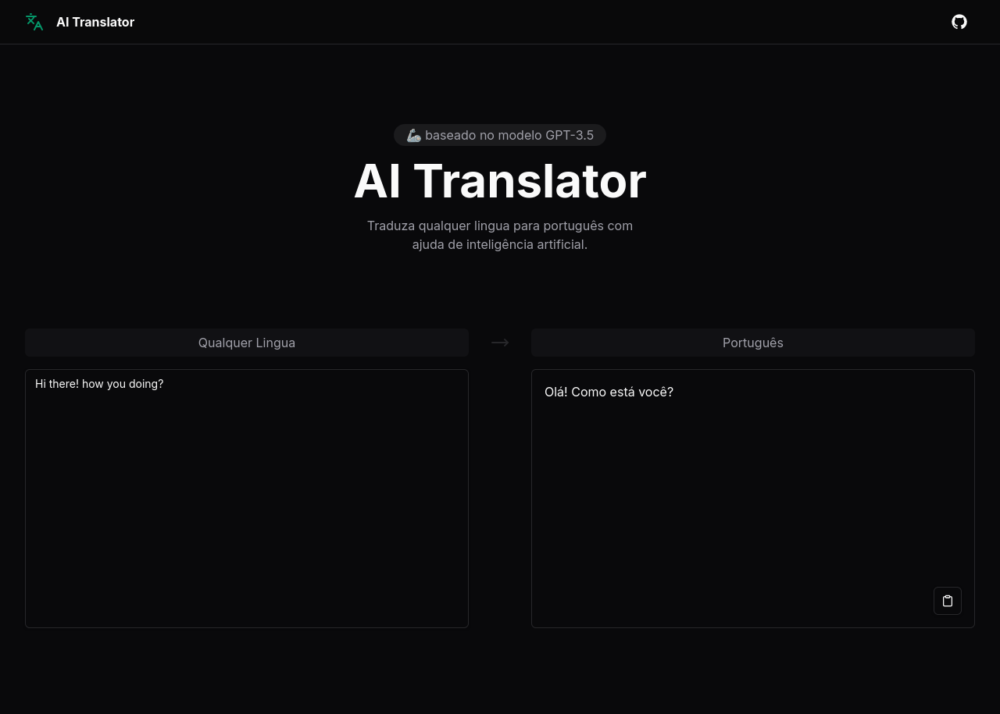

# AI Powered APP

Uma serie de experimentos com o framework LangChain, incluindo um tradutor para português baseado no modelo GPT-3.5.



## Como rodar:

Backend:
```bash
cd backend
#nix-shell # se você usa o NixOS
pip install -r requirements.txt
mv example.env .env # não se esqueça de inserir sua chave OpenAI
python main.py
```

Frontend:
```bash
cd frontend
#nix-shell # se você usa o NixOS
npm install
npm run dev
```
